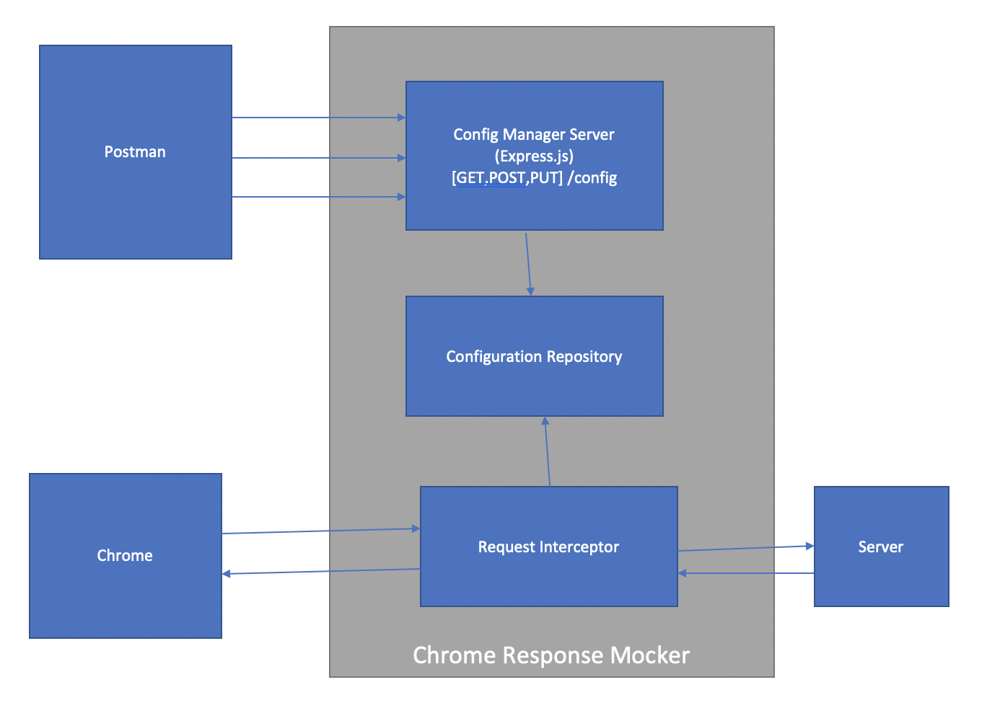

# Chrome Mock Response

## Overview
This Node.js tool uses Chrome Debugging Protocol to intercept Network calls made from target Chrome instance. It also maintains repository of responses to be returned when specific URL pattern and Method match.

This tool has following components:
- Configuration objects

| Property  | Type  | required | default |example |
|---|---|---|---|---|
| id  | number   | Yes | | |
| pattern  | string   | Yes | '' | '*/api/test' |
| partial  | boolean   |  | True | |
| methods  | Array<string>   | | [ 'PUT', 'GET', 'POST', 'DELETE' ] | ['GET] |
| enabled  | boolean   |  | True | |
| intercept  | string   |  | 'Request' | |
| response  | object   | Yes | null | { code: 400, body: 'Mock Error Response' } |

- Configuration Repository Service
  Stores and managers Configuration objects

- Configuration Api Server
  Express.js Instance providing RESTful interface to manage configuration objects. Default Port: 4300

| Endpoint  | Request Body   | Notes |
|---|---|---|
| GET /config  |   | Returns all configuration objects stored in Configuration Repository |
| POST /config | {pattern: '*/api/mytest', response: {code: 500, body: 'Internal Server Error from Mock Server'} }  |  Insert given configuration to repository. Takes default values for properties not provided |
| PUT /config/:id | {pattern: '*/api/mytest', response: {code: 500, body: 'Internal Server Error from Mock Server'} }  | Takes config object id as URL parameter Insert given configuration to repository. Takes default values for properties not provided |

- Chrome Request Interceptor
  Intercepts Network calls made from Chrome, and checks if any configuration object exists in Configuration Repository with matching URL pattern. If it finds the configuration object, then returns the response status code and reponse body specified in that configuration object.

## Running Chrome Mock Responser

### Install dependecies
  Execute `npm install` to install all required node package dependecies

### Start Configuration Api Server and Request Handler
  Execute `npm run start` to  start Configuration Api Server as well as request handler

## Other resources
  [Postman Collection for Configuration Sever APIs](postman_collection.json)

  [Chrome DevTools Protocol](https://chromedevtools.github.io/devtools-protocol/)